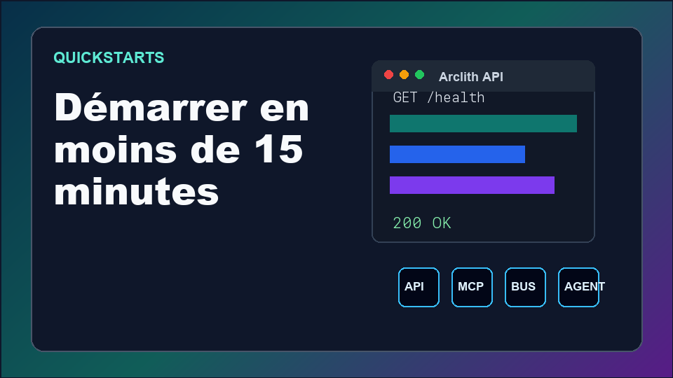
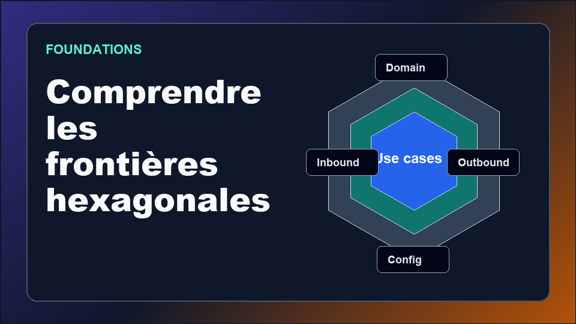
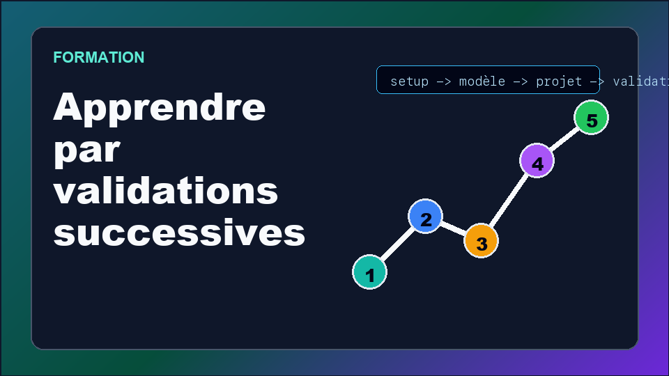
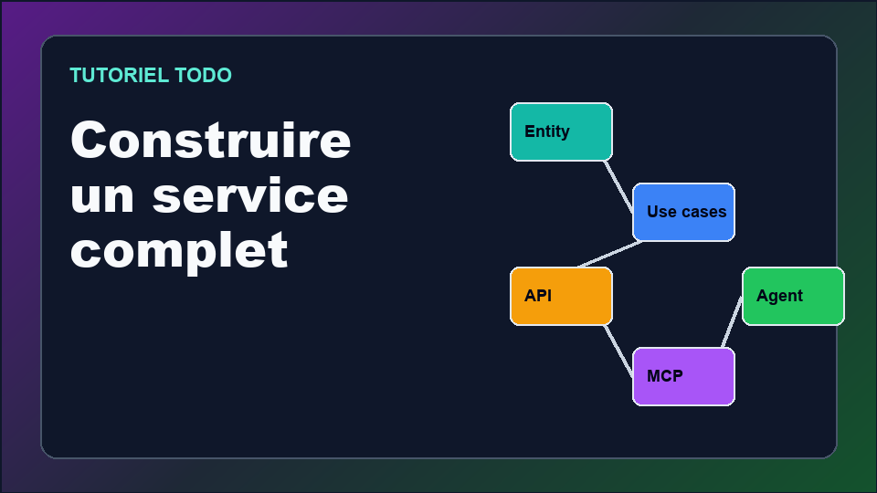
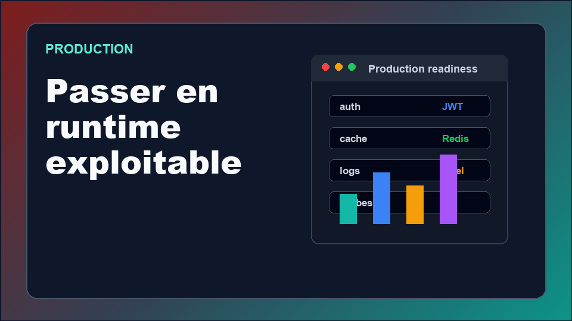
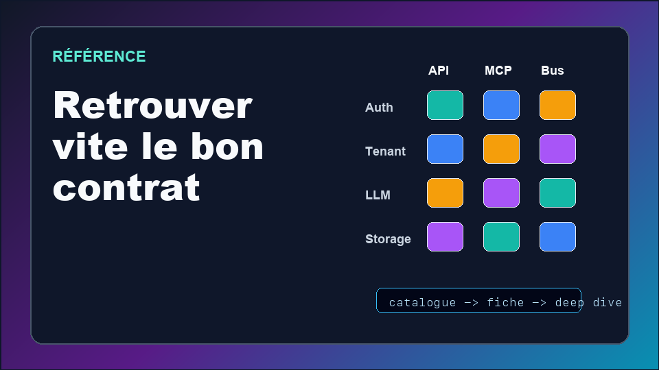

  <section class="academy-hero">
    

      
Arclith Academy

      <h1>Du quickstart au microservice prêt à produire.</h1>
      

        Apprends Arclith par parcours courts: démarrer vite, comprendre les
        frontières hexagonales, construire un service Todo complet, puis durcir
        l'exploitation.
      

      

        <a class="md-button md-button--primary" href="quickstarts/">Démarrer</a>
        <a class="md-button" href="learning/training-path/">Se former</a>
        <a class="md-button" href="production/baseline/">Produire</a>
      

    

    

      <video
        controls
        preload="metadata"
        poster="assets/academy/hero-poster.png"
        aria-label="Vidéo d'introduction Arclith Academy"
      >
        <source src="assets/academy/arclith-academy-intro.mp4" type="video/mp4" />
        <track
          default
          kind="captions"
          label="Français"
          src="assets/academy/arclith-academy-intro.fr.vtt"
          srclang="fr"
        />
        Votre navigateur ne peut pas lire cette vidéo.
      </video>
    

  </section>

  <section class="academy-section" aria-labelledby="academy-categories-title">
    

      
Catégories

      <h2 id="academy-categories-title">Choisir son entrée</h2>
      

        Chaque entrée correspond à une intention de lecture: exécuter, comprendre,
        construire, produire ou retrouver un contrat.
      

    

    

      <a class="academy-card" href="quickstarts/">
        
        Quickstarts
        <strong>Démarrer vite</strong>
        
API, MCP, bus ou agent en parcours courts et validables.

      </a>

      <a class="academy-card" href="foundations/what-is-arclith/">
        
        Foundations
        <strong>Comprendre le modèle</strong>
        
Domaine, ports, adapters et runtimes sans mélanger les frontières.

      </a>

      <a class="academy-card" href="learning/training-path/">
        
        Formation
        <strong>Suivre le parcours</strong>
        
Progression guidée avec validations et autonomie finale.

      </a>

      <a class="academy-card" href="tutorials/todo-list/">
        
        Projet
        <strong>Construire Todo</strong>
        
Le fil rouge pour exposer API, MCP et agent sur un même domaine.

      </a>

      <a class="academy-card" href="production/baseline/">
        
        Production
        <strong>Durcir l'exploitation</strong>
        
Baseline, auth, secrets, observabilité, Docker et Kubernetes.

      </a>

      <a class="academy-card" href="capabilities/">
        
        Référence
        <strong>Retrouver un contrat</strong>
        
Catalogue des capabilities, fiches dédiées et deep dives.

      </a>
    

  </section>

  <section class="academy-section" aria-labelledby="academy-featured-title">
    

      
Parcours mis en avant

      <h2 id="academy-featured-title">La prochaine page utile</h2>
    

    

      <a href="quickstarts/api/">Quickstart API</a>
      <a href="learning/setup/">Préparer son poste</a>
      <a href="learning/foundations/">Comprendre le modèle</a>
      <a href="tutorials/todo-list/">Tutoriel Todo complet</a>
      <a href="production/runtime/">Runtime et probes</a>
      <a href="capabilities/storage/">Storage</a>
      <a href="deep-dives/agent/">Deep dive agent</a>
      <a href="release/">Publier une version</a>
    

  </section>

