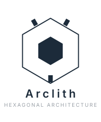

---
hide:
  - navigation
  - toc
---

  <section class="academy-hero">
    

      
      
Arclith Academy

      <h1>Du POC au projet complet, avec des frontières claires.</h1>
      

        Apprends Arclith dans le bon ordre: quickstart pour voir tourner,
        foundations pour installer et comprendre, formation pour pratiquer,
        capabilities pour approfondir, puis projets end to end.
      

      <nav class="academy-actions" aria-label="Actions principales">
        <a class="md-button md-button--primary" href="quickstarts/">Démarrer</a>
        <a class="md-button" href="learning/training-path/">Se former</a>
        <a class="md-button" href="capabilities/">Approfondir</a>
      </nav>
    

    

      <video
        controls
        preload="metadata"
        poster="assets/academy/hero-poster.png"
        aria-label="Vidéo d'introduction Arclith Academy"
      >
        <source src="assets/academy/arclith-academy-intro.mp4" type="video/mp4" />
        <track
          default
          kind="captions"
          label="Français"
          src="assets/academy/arclith-academy-intro.fr.vtt"
          srclang="fr"
        />
        Votre navigateur ne peut pas lire cette vidéo.
      </video>
    

  </section>

  <section class="academy-section" aria-labelledby="academy-categories-title">
    

      
Parcours

      <h2 id="academy-categories-title">Choisir le bon niveau de lecture</h2>
      

        Chaque section correspond à une intention: tester vite, comprendre,
        apprendre un geste, approfondir un contrat ou réaliser un projet complet.
      

    

    

      <a class="academy-card" href="quickstarts/">
        
        Quickstart
        <strong>Valider le POC</strong>
        
Démarrage rapide pour voir comment Arclith fonctionne et donner envie d'aller plus loin.

      </a>

      <a class="academy-card" href="foundations/what-is-arclith/">
        
        Foundations
        <strong>Préparer et comprendre</strong>
        
Setup, Python, outils locaux, environnements et concepts nécessaires avant les formations.

      </a>

      <a class="academy-card" href="learning/training-path/">
        
        Formation
        <strong>Apprendre un geste</strong>
        
Pas à pas ciblés pour créer une entité, un use case, un port ou un adapter.

      </a>

      <a class="academy-card" href="capabilities/">
        
        Capabilities
        <strong>Approfondir un contrat</strong>
        
Détail complet, deep dives, contraintes runtime et liens vers les formations associées.

      </a>

      <a class="academy-card" href="tutorials/todo-list/">
        
        Projets
        <strong>Construire de A à Z</strong>
        
Réalisation end to end d'un projet concret avec domaine, API, MCP, agent et persistance.

      </a>
    

  </section>

  <section class="academy-section" aria-labelledby="academy-featured-title">
    

      
Chemin recommandé

      <h2 id="academy-featured-title">La prochaine étape utile</h2>
    

    

      <a href="quickstarts/">Quickstart</a>
      <a href="learning/setup/">Préparer son poste</a>
      <a href="foundations/what-is-arclith/">Comprendre Arclith</a>
      <a href="learning/training-path/">Parcours de formation</a>
      <a href="capabilities/structure/">Structure d'une capability</a>
      <a href="capabilities/storage/">Storage</a>
      <a href="production/baseline/">Baseline production</a>
      <a href="tutorials/todo-list/">Projet Todo complet</a>
    

  </section>

