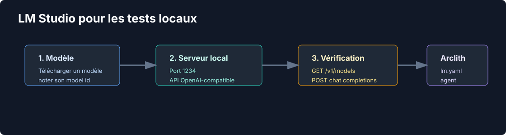

# Préparer LM Studio

Objectif: disposer d'un LLM local disponible sur une API OpenAI-compatible, afin que l'agent Arclith
puisse produire des sorties structurées sans dépendre d'OpenAI ou Anthropic.



LM Studio joue ici deux rôles distincts:

- serveur LLM local pour l'agent LangGraph via `http://127.0.0.1:1234/v1`;
- client MCP possible pour tester les tools exposés par FastMCP.

Les références utiles sont la documentation officielle du serveur local LM Studio
<https://lmstudio.ai/docs/developer/core/server> et la documentation MCP
<https://lmstudio.ai/docs/app/mcp>.

## Installer LM Studio

1. Télécharger LM Studio depuis <https://lmstudio.ai/>.
2. Ouvrir l'application.
3. Aller dans la recherche de modèles.
4. Télécharger un modèle raisonnable pour votre machine.

Pour ce tutoriel, garder le modèle exact affiché par LM Studio. Exemple:

```text
mistralai/ministral-3-3b
```

Le nom doit être recopié tel quel dans `config/adapters/outbound/lm.yaml`. Un alias inventé comme
`local-model` peut être refusé par LM Studio.

## Lancer le serveur minimal

Dans LM Studio:

1. Ouvrir l'onglet développeur ou serveur local.
2. Choisir le port `1234`.
3. Activer l'API OpenAI-compatible.
4. Démarrer le serveur.

Le serveur doit exposer:

```text
GET  http://127.0.0.1:1234/v1/models
POST http://127.0.0.1:1234/v1/chat/completions
```

Vérifier depuis le terminal:

```bash
curl -fsS http://127.0.0.1:1234/v1/models | python -m json.tool
```

Résultat attendu: une liste `data` avec au moins un `id` de modèle.

Tester un appel simple:

```bash
curl -fsS http://127.0.0.1:1234/v1/chat/completions \
  -H "Content-Type: application/json" \
  -d '{
    "model": "mistralai/ministral-3-3b",
    "messages": [
      {"role": "user", "content": "Réponds uniquement: ok"}
    ],
    "stream": false
  }' | python -m json.tool
```

Tester ensuite le même endpoint avec le client Python utilisé côté agent:

```bash
uv run --with langchain-openai python - <<'PY'
from langchain_openai import ChatOpenAI

llm = ChatOpenAI(
    model="mistralai/ministral-3-3b",
    base_url="http://127.0.0.1:1234/v1",
    api_key="lm-studio",
    temperature=0,
)

response = llm.invoke("Réponds uniquement: ok")
print(response.content)
PY
```

Remplacer `mistralai/ministral-3-3b` par l'`id` exact retourné par `/v1/models`. Ce deuxième test
prouve que le serveur LM Studio et l'intégration OpenAI-compatible utilisée par LangChain sont
cohérents.

## Informations à garder

| Élément | Valeur locale du tutoriel |
| --- | --- |
| Base URL | `http://127.0.0.1:1234/v1` |
| API key | `lm-studio` si l'authentification est désactivée |
| Model ID | le `id` exact visible dans `/v1/models` |

Ces valeurs seront utilisées à l'étape 6:

```bash
arclith-cli add-adapter \
  --capability llm \
  --adapter lmstudio \
  --param model_name=mistralai/ministral-3-3b \
  --yes
```

## Captures à ajouter

À remplacer par vos captures ou une vidéo courte:

- recherche et téléchargement du modèle;
- bouton de démarrage du serveur local;
- liste des endpoints ou réponse `/v1/models`;
- model id recopié dans la configuration Arclith.

## Problèmes fréquents

| Symptôme | Cause probable | Action |
| --- | --- | --- |
| `Connection refused` | serveur LM Studio arrêté | démarrer le serveur local |
| `invalid model identifier` | model id incorrect | recopier l'`id` de `/v1/models` |
| erreur `response_format` | version Arclith incompatible | utiliser `arclith>=0.15.0` |
| appel depuis Docker impossible | `localhost` pointe dans le container | utiliser `host.docker.internal:1234` |

Pour un guide plus complet sur le mode hors ligne, lire
[Validation IA locale et hors ligne](../../learning/local-ai-validation.md).

Étape suivante: [initialiser le projet](01-init-project.md).
