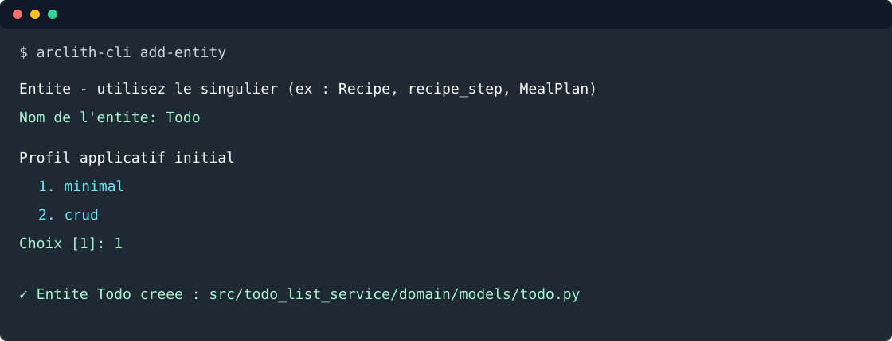

# 2. Créer l'entité Todo

Objectif: utiliser la CLI pour créer le fichier minimal, puis écrire le modèle métier et ses tests.



Depuis la racine du projet:

```bash
arclith-cli add-entity
```

Répondre au prompt:

```text
Entité — utilisez le singulier (ex : Recipe, recipe_step, MealPlan)
  Nom de l'entité: Todo
```

La CLI crée:

```text
src/todo_list_service/domain/models/todo.py
```

Modifier `src/todo_list_service/domain/models/todo.py`:

```python
from __future__ import annotations

from datetime import date, datetime
from enum import StrEnum

from arclith.domain.models.entity import Entity
from pydantic import Field, field_validator, model_validator


class TodoStatus(StrEnum):
    TODO = "todo"
    WIP = "wip"
    DONE = "done"


class Todo(Entity):
    title: str = Field(min_length=1, max_length=140)
    description: str = Field(default="", max_length=4000)
    due_date: date
    completed_at: datetime | None = None
    status: TodoStatus = TodoStatus.TODO

    @field_validator("title")
    @classmethod
    def normalize_title(cls, value: str) -> str:
        normalized = value.strip()
        if not normalized:
            raise ValueError("title ne peut pas etre vide")
        return normalized

    @field_validator("description")
    @classmethod
    def normalize_description(cls, value: str) -> str:
        return value.strip()

    @model_validator(mode="after")
    def validate_completion(self) -> "Todo":
        if self.status == TodoStatus.DONE and self.completed_at is None:
            raise ValueError("completed_at est requis quand status=done")
        if self.status != TodoStatus.DONE and self.completed_at is not None:
            raise ValueError("completed_at doit rester vide tant que la todo n'est pas done")
        return self
```

Commentaires importants:

- `Todo` hérite de `Entity`, donc Arclith fournit déjà `uuid`, `created_at`, `updated_at`,
  `deleted_at` et `version`;
- `TodoStatus` est une enum de chaîne pour produire des valeurs JSON lisibles;
- les invariants métier restent dans le domaine, pas dans FastAPI, MCP ou LangGraph.

## Tester

Créer `tests/test_todo_entity.py`:

```python
from datetime import date, datetime, timezone

import pytest
from pydantic import ValidationError

from todo_list_service.domain.models.todo import Todo, TodoStatus


def test_create_todo_with_required_fields() -> None:
    todo = Todo(title="  Preparer la revue  ", due_date=date(2026, 8, 31))

    assert todo.title == "Preparer la revue"
    assert todo.description == ""
    assert todo.status == TodoStatus.TODO
    assert todo.completed_at is None


def test_done_requires_completed_at() -> None:
    with pytest.raises(ValidationError):
        Todo(title="Publier", due_date=date(2026, 8, 31), status=TodoStatus.DONE)


def test_completed_at_is_rejected_before_done() -> None:
    with pytest.raises(ValidationError):
        Todo(
            title="Publier",
            due_date=date(2026, 8, 31),
            completed_at=datetime.now(timezone.utc),
            status=TodoStatus.WIP,
        )
```

Lancer:

```bash
uv run python -m pytest tests/test_todo_entity.py
```

## Voie rapide

```bash
arclith-cli add-entity Todo
```

Étape suivante: [créer les use cases](03-create-usecase.md).
