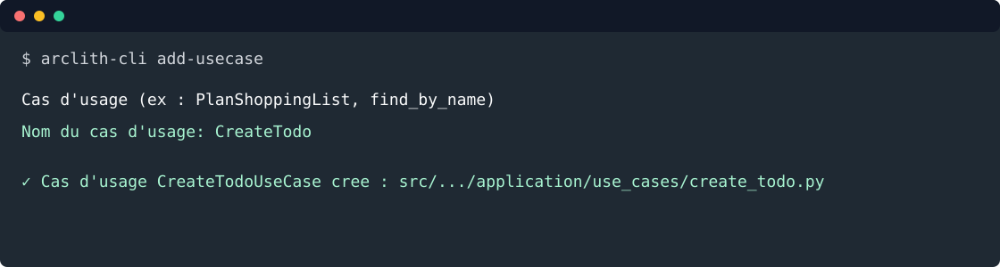

# 3. Créer les use cases

Objectif: utiliser la CLI pour créer les ports inbound et les fichiers minimaux, puis écrire les cas
d'usage qui enregistrent et listent les todos via un port repository.



Depuis la racine du projet:

```bash
arclith-cli add-usecase
```

Répondre au prompt:

```text
Cas d'usage (ex : PlanShoppingList, find_by_name)
  Nom du cas d'usage: CreateTodo
```

Relancer le wizard pour le listing:

```bash
arclith-cli add-usecase
```

Répondre au prompt:

```text
Cas d'usage (ex : PlanShoppingList, find_by_name)
  Nom du cas d'usage: ListTodos
```

La CLI crée:

```text
src/todo_list_service/domain/ports/inbound/create_todo.py
src/todo_list_service/domain/ports/inbound/list_todos.py
src/todo_list_service/application/use_cases/create_todo.py
src/todo_list_service/application/use_cases/list_todos.py
```


Créer les packages applicatifs:

```bash
touch src/todo_list_service/application/use_cases/__init__.py
```

Modifier `src/todo_list_service/domain/ports/inbound/create_todo.py`:

```python
from __future__ import annotations

from abc import ABC, abstractmethod
from datetime import date, datetime

from pydantic import BaseModel, Field

from todo_list_service.domain.models.todo import Todo, TodoStatus


class CreateTodoCommand(BaseModel):
    title: str = Field(min_length=1, max_length=140)
    description: str = Field(default="", max_length=4000)
    due_date: date
    status: TodoStatus = TodoStatus.TODO
    completed_at: datetime | None = None


class CreateTodoPort(ABC):
    @abstractmethod
    async def execute(self, command: CreateTodoCommand) -> Todo:
        raise NotImplementedError
```

Modifier `src/todo_list_service/application/use_cases/create_todo.py`:

```python
from __future__ import annotations

from datetime import datetime, timezone

from arclith.domain.ports.outbound.repository import Repository

from todo_list_service.domain.models.todo import Todo, TodoStatus
from todo_list_service.domain.ports.inbound.create_todo import CreateTodoCommand, CreateTodoPort


class CreateTodoUseCase(CreateTodoPort):
    def __init__(self, repository: Repository[Todo]) -> None:
        self._repository = repository

    async def execute(self, command: CreateTodoCommand) -> Todo:
        completed_at = command.completed_at
        if command.status == TodoStatus.DONE and completed_at is None:
            completed_at = datetime.now(timezone.utc)

        todo = Todo(
            title=command.title,
            description=command.description,
            due_date=command.due_date,
            status=command.status,
            completed_at=completed_at,
        )
        return await self._repository.create(todo)
```

Modifier `src/todo_list_service/domain/ports/inbound/list_todos.py`:

```python
from __future__ import annotations

from abc import ABC, abstractmethod

from pydantic import BaseModel, Field

from todo_list_service.domain.models.todo import Todo


class ListTodosQuery(BaseModel):
    page: int = Field(default=1, ge=1)
    per_page: int = Field(default=20, ge=1, le=100)


class ListTodosResult(BaseModel):
    items: list[Todo]
    total: int = Field(ge=0)
    page: int = Field(ge=1)
    per_page: int = Field(ge=1, le=100)


class ListTodosPort(ABC):
    @abstractmethod
    async def execute(self, query: ListTodosQuery) -> ListTodosResult:
        raise NotImplementedError
```

Modifier `src/todo_list_service/application/use_cases/list_todos.py`:

```python
from __future__ import annotations

from arclith.domain.ports.outbound.repository import Repository

from todo_list_service.domain.models.todo import Todo
from todo_list_service.domain.ports.inbound.list_todos import (
    ListTodosPort,
    ListTodosQuery,
    ListTodosResult,
)


class ListTodosUseCase(ListTodosPort):
    def __init__(self, repository: Repository[Todo]) -> None:
        self._repository = repository

    async def execute(self, query: ListTodosQuery) -> ListTodosResult:
        offset = (query.page - 1) * query.per_page
        items, total = await self._repository.find_page(offset=offset, limit=query.per_page)
        return ListTodosResult(
            items=items,
            total=total,
            page=query.page,
            per_page=query.per_page,
        )
```

Les use cases implémentent les ports inbound et dépendent seulement de `Repository[Todo]`. Ils ne
connaissent ni FastAPI, ni FastMCP, ni LangGraph, ni MongoDB.

## Container applicatif

Créer `src/todo_list_service/infrastructure/containers/todo_container.py`:

```python
from __future__ import annotations

from weakref import WeakKeyDictionary

from arclith import Arclith
from arclith.domain.ports.outbound.repository import Repository

from todo_list_service.application.use_cases.create_todo import CreateTodoUseCase
from todo_list_service.application.use_cases.list_todos import ListTodosUseCase
from todo_list_service.domain.models.todo import Todo
from todo_list_service.domain.ports.inbound.create_todo import CreateTodoPort
from todo_list_service.domain.ports.inbound.list_todos import ListTodosPort

_repositories: WeakKeyDictionary[Arclith, Repository[Todo]] = WeakKeyDictionary()


def build_todo_repository(app: Arclith) -> Repository[Todo]:
    repository = _repositories.get(app)
    if repository is None:
        repository = app.repository(Todo)
        _repositories[app] = repository
    return repository


def clear_todo_repository_cache() -> None:
    _repositories.clear()


def build_create_todo_use_case(app: Arclith) -> CreateTodoPort:
    return CreateTodoUseCase(build_todo_repository(app))


def build_list_todos_use_case(app: Arclith) -> ListTodosPort:
    return ListTodosUseCase(build_todo_repository(app))
```

Le cache par instance `Arclith` permet de partager un repository `memory` dans le même processus tout
en gardant les tests isolables avec `clear_todo_repository_cache()`.

## Tester

Créer `tests/test_todo_usecases.py`:

```python
from datetime import date

import pytest
from arclith.adapters.outbound.memory.repository import InMemoryRepository

from todo_list_service.application.use_cases.create_todo import CreateTodoUseCase
from todo_list_service.application.use_cases.list_todos import ListTodosUseCase
from todo_list_service.domain.models.todo import Todo, TodoStatus
from todo_list_service.domain.ports.inbound.create_todo import CreateTodoCommand
from todo_list_service.domain.ports.inbound.list_todos import ListTodosQuery


@pytest.mark.asyncio
async def test_create_todo_persists_entity() -> None:
    repository = InMemoryRepository[Todo]()
    use_case = CreateTodoUseCase(repository)

    todo = await use_case.execute(
        CreateTodoCommand(
            title="Ecrire le tutoriel",
            description="Couvrir API, MCP et agent",
            due_date=date(2026, 9, 1),
        )
    )

    assert todo.status == TodoStatus.TODO
    assert await repository.read(todo.uuid) == todo


@pytest.mark.asyncio
async def test_done_todo_gets_completion_date() -> None:
    repository = InMemoryRepository[Todo]()
    use_case = CreateTodoUseCase(repository)

    todo = await use_case.execute(
        CreateTodoCommand(
            title="Publier",
            due_date=date(2026, 9, 1),
            status=TodoStatus.DONE,
        )
    )

    assert todo.completed_at is not None


@pytest.mark.asyncio
async def test_list_todos_returns_persisted_entities() -> None:
    repository = InMemoryRepository[Todo]()
    create_todo = CreateTodoUseCase(repository)
    list_todos = ListTodosUseCase(repository)

    todo = await create_todo.execute(
        CreateTodoCommand(
            title="Tester le listing",
            due_date=date(2026, 9, 1),
        )
    )

    result = await list_todos.execute(ListTodosQuery())

    assert result.items == [todo]
    assert result.total == 1
    assert result.page == 1
    assert result.per_page == 20
```

Lancer:

```bash
uv run python -m pytest tests/test_todo_entity.py tests/test_todo_usecases.py
```

## Voie rapide

```bash
arclith-cli add-usecase CreateTodo
arclith-cli add-usecase ListTodos
```

Étape suivante: [exposer une API](04-api.md).
