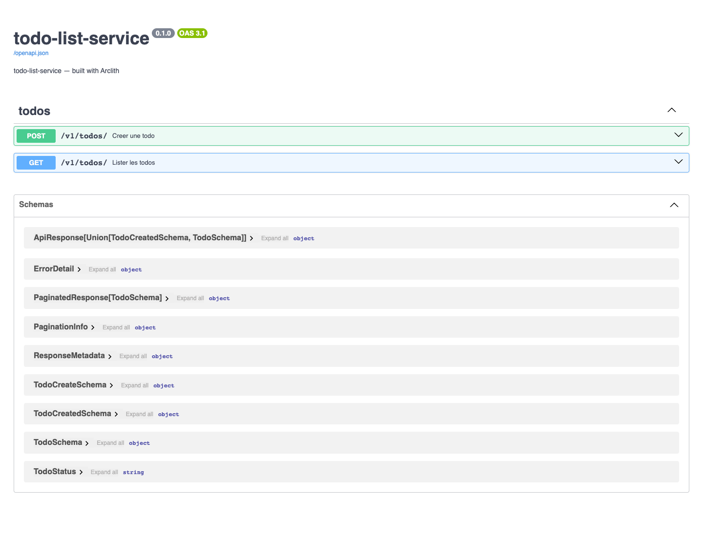

# 4.4 Tester l'API

Intention: vérifier que l'adapter HTTP expose bien le contrat attendu et appelle les use cases.

## Tests Python

Lancer les tests:

```bash
uv run python -m pytest
```

## Smoke local

Lancer l'API:

```bash
uv run python main.py
```

Ouvrir Swagger UI:

```text
http://127.0.0.1:8120/docs
```

Swagger est l'écran généré par FastAPI à partir du contrat OpenAPI. Il permet de vérifier que
l'adapter HTTP publie les routes, les schémas de payload, les exemples et les statuts de réponse.



Dans Swagger, ouvrir `POST /v1/todos/`, cliquer sur `Try it out`, puis envoyer:

```json
{
  "title": "Ecrire le tutoriel",
  "description": "Couvrir API, MCP et agent",
  "due_date": "2026-09-01",
  "status": "todo"
}
```

Dans un autre terminal:

```bash
curl -fsS http://127.0.0.1:9000/health
curl -i -fsS -X POST http://127.0.0.1:8120/v1/todos/   -H "Content-Type: application/json"   -H "Idempotency-Key: todo-demo-1"   -d '{
    "title": "Ecrire le tutoriel",
    "description": "Couvrir API, MCP et agent",
    "due_date": "2026-09-01",
    "status": "todo"
  }'

curl -i -fsS "http://127.0.0.1:8120/v1/todos/?page=1&per_page=20"
curl -fsS http://127.0.0.1:8120/openapi.json | python -m json.tool
```

À vérifier:

- le `POST` retourne `201`, `Location`, `Link` et une enveloppe `{ "status": "success", "data": ... }`;
- le `GET` retourne `200`, `X-Total-Count`, `pagination` et une liste dans `data`;
- `/docs` et `/openapi.json` affichent les `operationId`, exemples, headers et réponses `422`.

Étape suivante: [exposer un MCP](05-mcp.md).
