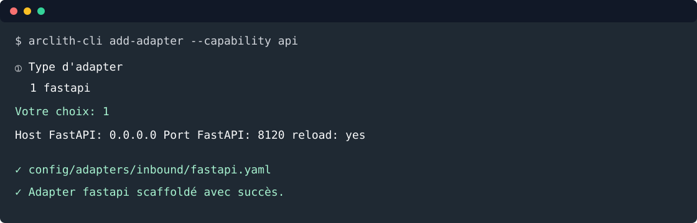

# 4. Exposer une API

Objectif: générer la configuration FastAPI avec la CLI, puis exposer `CreateTodoPort` et
`ListTodosPort` par HTTP.



Depuis la racine du projet:

```bash
arclith-cli add-adapter --capability api
```

Répondre aux prompts:

```text
① Type d'adapter
   1  fastapi

  Votre choix (numéro ou nom): 1

③ Paramètres fastapi
  Host FastAPI (0.0.0.0): 0.0.0.0
  Port FastAPI (8000): 8120
  Activer le reload FastAPI [y/n] (y): y

  Confirmer la génération ? [y/n] (y): y
```

La CLI crée:

```text
config/adapters/inbound/fastapi.yaml
```

## Niveau de maturité API attendu

Même dans un tutoriel, l'API doit publier un contrat propre dans `/docs` et `/openapi.json`.
L'objectif est de montrer le standard Arclith attendu:

- les routes appellent des ports inbound, jamais un repository;
- chaque endpoint déclare `status_code`, `response_model`, `responses`, `summary`,
  `description`, `response_description` et `operation_id`;
- les réponses suivent les enveloppes `ApiResponse` et `PaginatedResponse`;
- les headers utiles (`Location`, `Link`, `X-Total-Count`, `X-Idempotency-Replay`) sont
  documentés;
- les paramètres HTTP (`Prefer`, `page`, `per_page`) sont typés avec `Header` et `Query`;
- les schémas Pydantic portent descriptions et exemples pour enrichir Swagger UI.

## Schémas HTTP

Créer `src/todo_list_service/adapters/inbound/schemas/todo_schema.py`:

```python
from __future__ import annotations

from datetime import date, datetime
from uuid import UUID

from pydantic import BaseModel, ConfigDict, Field

from todo_list_service.domain.models.todo import TodoStatus


class TodoCreateSchema(BaseModel):
    model_config = ConfigDict(
        json_schema_extra={
            "examples": [
                {
                    "title": "Écrire le tutoriel",
                    "description": "Couvrir API, MCP et agent",
                    "due_date": "2026-09-01",
                    "status": "todo",
                }
            ]
        }
    )

    title: str = Field(
        min_length=1,
        max_length=140,
        description="Titre court de la todo.",
        examples=["Écrire le tutoriel"],
    )
    description: str = Field(
        default="",
        max_length=4000,
        description="Description détaillée.",
        examples=["Couvrir API, MCP et agent"],
    )
    due_date: date = Field(
        description="Date d'échéance au format ISO 8601.",
        examples=["2026-09-01"],
    )
    status: TodoStatus = Field(
        default=TodoStatus.TODO,
        description="Statut courant de la todo.",
        examples=["todo"],
    )
    completed_at: datetime | None = Field(
        default=None,
        description="Date de réalisation, uniquement quand le statut est done.",
        examples=[None],
    )


class TodoCreatedSchema(BaseModel):
    uuid: UUID = Field(
        description="Identifiant public de la todo créée.",
        examples=["01951234-5678-7abc-def0-123456789abc"],
    )


class TodoSchema(BaseModel):
    model_config = ConfigDict(
        from_attributes=True,
        json_schema_extra={
            "examples": [
                {
                    "uuid": "01951234-5678-7abc-def0-123456789abc",
                    "title": "Écrire le tutoriel",
                    "description": "Couvrir API, MCP et agent",
                    "due_date": "2026-09-01",
                    "completed_at": None,
                    "status": "todo",
                    "created_at": "2026-08-07T10:30:00Z",
                    "updated_at": "2026-08-07T10:30:00Z",
                    "version": 1,
                }
            ]
        },
    )

    uuid: UUID = Field(description="Identifiant public de la todo.")
    title: str = Field(description="Titre court.")
    description: str = Field(description="Description détaillée.")
    due_date: date = Field(description="Date d'échéance.")
    completed_at: datetime | None = Field(
        description="Date de réalisation éventuelle."
    )
    status: TodoStatus = Field(description="Statut courant.")
    created_at: datetime = Field(description="Date de création.")
    updated_at: datetime = Field(description="Date de dernière modification.")
    version: int = Field(
        description="Version métier utilisée par les mécanismes HTTP comme ETag."
    )
```

Créer aussi le package:

```bash
mkdir -p src/todo_list_service/adapters/inbound/schemas
touch src/todo_list_service/adapters/inbound/schemas/__init__.py
```

## Handlers FastAPI

Les handlers adaptent HTTP vers les ports inbound. Ils convertissent les schémas HTTP en commandes
applicatives et ne connaissent ni repository, ni MongoDB, ni adapter de persistance.
Ils peuvent en revanche traduire une erreur applicative en statut HTTP, car cette traduction fait
partie du rôle de l'adapter inbound.

Créer `src/todo_list_service/adapters/inbound/fastapi/handlers/todo_handlers.py`:

```python
from __future__ import annotations

from typing import Annotated

from fastapi import Header, HTTPException, Query, Request, Response
from pydantic import ValidationError

from arclith.adapters.inbound.schemas import (
    ApiResponse,
    PaginatedResponse,
    paginated_response,
    success_response,
)
from todo_list_service.adapters.inbound.schemas.todo_schema import (
    TodoCreatedSchema,
    TodoCreateSchema,
    TodoSchema,
)
from todo_list_service.domain.ports.inbound.create_todo import CreateTodoCommand, CreateTodoPort
from todo_list_service.domain.ports.inbound.list_todos import ListTodosPort, ListTodosQuery


class TodoHandlers:
    def __init__(self, create_todo: CreateTodoPort, list_todos: ListTodosPort) -> None:
        self._create_todo = create_todo
        self._list_todos = list_todos

    async def create_todo(
        self,
        payload: TodoCreateSchema,
        response: Response,
        request: Request,
        prefer: Annotated[
            str | None,
            Header(
                description=(
                    "RFC 7240. Utiliser return=representation pour recevoir "
                    "la todo complète."
                )
            ),
        ] = None,
    ) -> ApiResponse[TodoCreatedSchema | TodoSchema]:
        try:
            todo = await self._create_todo.execute(
                CreateTodoCommand(
                    title=payload.title,
                    description=payload.description,
                    due_date=payload.due_date,
                    status=payload.status,
                    completed_at=payload.completed_at,
                )
            )
        except ValidationError as exc:
            raise HTTPException(status_code=422, detail=exc.errors()) from exc
        except ValueError as exc:
            raise HTTPException(status_code=422, detail=str(exc)) from exc

        collection_url = request.url.path.rstrip("/")
        location = f"{collection_url}/{todo.uuid}"
        links = {"self": location, "collection": collection_url}

        response.headers["Location"] = location
        response.headers["Link"] = (
            f'<{location}>; rel="self", <{collection_url}>; rel="collection"'
        )

        if prefer and "return=representation" in prefer.lower():
            return success_response(TodoSchema.model_validate(todo), links=links)
        return success_response(TodoCreatedSchema(uuid=todo.uuid), links=links)

    async def list_todos(
        self,
        response: Response,
        request: Request,
        page: Annotated[
            int,
            Query(ge=1, description="Page à retourner, à partir de 1."),
        ] = 1,
        per_page: Annotated[
            int,
            Query(ge=1, le=100, description="Nombre d'éléments par page."),
        ] = 20,
    ) -> PaginatedResponse[TodoSchema]:
        result = await self._list_todos.execute(
            ListTodosQuery(page=page, per_page=per_page)
        )
        todos = [TodoSchema.model_validate(todo) for todo in result.items]
        collection_url = request.url.path.rstrip("/")

        response.headers["X-Total-Count"] = str(result.total)
        response.headers["Link"] = f'<{collection_url}>; rel="self"'
        return paginated_response(
            todos,
            total=result.total,
            page=result.page,
            per_page=result.per_page,
            links={"self": collection_url},
        )
```

Créer le package handlers:

```bash
mkdir -p src/todo_list_service/adapters/inbound/fastapi/handlers
touch src/todo_list_service/adapters/inbound/fastapi/handlers/__init__.py
```

## Router FastAPI

Le router déclare uniquement les URLs, méthodes HTTP, modèles de réponse et métadonnées OpenAPI. Il
ne contient pas de logique métier.

Créer `src/todo_list_service/adapters/inbound/fastapi/routers/todo_router.py`:

```python
from __future__ import annotations

from fastapi import APIRouter

from arclith.adapters.inbound.schemas import ApiResponse, PaginatedResponse
from todo_list_service.adapters.inbound.fastapi.handlers.todo_handlers import TodoHandlers
from todo_list_service.adapters.inbound.schemas.todo_schema import (
    TodoCreatedSchema,
    TodoSchema,
)

_CREATED_TODO_EXAMPLE = {
    "status": "success",
    "data": {"uuid": "01951234-5678-7abc-def0-123456789abc"},
    "metadata": {
        "request_id": "01951234-5678-7abc-def0-123456789abc",
        "timestamp": "2026-08-07T10:30:00Z",
        "version": "v1",
        "links": {
            "self": "/v1/todos/01951234-5678-7abc-def0-123456789abc",
            "collection": "/v1/todos",
        },
    },
}

_FULL_TODO_EXAMPLE = {
    "status": "success",
    "data": {
        "uuid": "01951234-5678-7abc-def0-123456789abc",
        "title": "Écrire le tutoriel",
        "description": "Couvrir API, MCP et agent",
        "due_date": "2026-09-01",
        "completed_at": None,
        "status": "todo",
        "created_at": "2026-08-07T10:30:00Z",
        "updated_at": "2026-08-07T10:30:00Z",
        "version": 1,
    },
    "metadata": _CREATED_TODO_EXAMPLE["metadata"],
}

_TODO_LIST_EXAMPLE = {
    "status": "success",
    "data": [_FULL_TODO_EXAMPLE["data"]],
    "pagination": {
        "total": 1,
        "page": 1,
        "per_page": 20,
        "pages": 1,
        "has_next": False,
        "has_prev": False,
        "next_page": None,
        "prev_page": None,
    },
    "metadata": {
        "request_id": "01951234-5678-7abc-def0-123456789abc",
        "timestamp": "2026-08-07T10:30:00Z",
        "version": "v1",
        "links": {"self": "/v1/todos"},
    },
}

_VALIDATION_ERROR_RESPONSE = {
    "description": "Payload ou paramètres invalides.",
    "content": {
        "application/json": {
            "example": {
                "detail": [
                    {
                        "type": "greater_than_equal",
                        "loc": ["query", "page"],
                        "msg": "Input should be greater than or equal to 1",
                        "input": 0,
                        "ctx": {"ge": 1},
                    }
                ]
            }
        }
    },
}

_BAD_REQUEST_RESPONSE = {
    "description": "Requête invalide avant exécution du use case.",
    "content": {
        "application/json": {
            "example": {
                "detail": "Idempotency-Key exceeds 255 characters",
            }
        }
    },
}

_CREATE_TODO_RESPONSES = {
    201: {
        "description": (
            "Todo créée. La réponse minimale contient l'UUID; Prefer permet "
            "la représentation complète."
        ),
        "headers": {
            "Location": {
                "description": "URL canonique de la todo créée.",
                "schema": {"type": "string"},
            },
            "Link": {
                "description": "Liens HATEOAS self et collection.",
                "schema": {"type": "string"},
            },
            "X-Idempotency-Replay": {
                "description": "Présent à true si la réponse vient du cache d'idempotence.",
                "schema": {"type": "boolean"},
            },
        },
        "content": {
            "application/json": {
                "examples": {
                    "minimal": {
                        "summary": "Réponse par défaut",
                        "value": _CREATED_TODO_EXAMPLE,
                    },
                    "representation": {
                        "summary": "Avec Prefer: return=representation",
                        "value": _FULL_TODO_EXAMPLE,
                    },
                }
            }
        },
    },
    400: _BAD_REQUEST_RESPONSE,
    422: _VALIDATION_ERROR_RESPONSE,
}

_LIST_TODOS_RESPONSES = {
    200: {
        "description": "Page de todos actives.",
        "headers": {
            "X-Total-Count": {
                "description": "Nombre total de todos actives avant pagination.",
                "schema": {"type": "integer"},
            },
            "Link": {
                "description": "Lien HATEOAS vers la collection.",
                "schema": {"type": "string"},
            },
        },
        "content": {"application/json": {"example": _TODO_LIST_EXAMPLE}},
    },
    422: _VALIDATION_ERROR_RESPONSE,
}


def build_todo_router(handlers: TodoHandlers) -> APIRouter:
    router = APIRouter(prefix="/v1/todos", tags=["todos"])
    router.add_api_route(
        "/",
        handlers.create_todo,
        methods=["POST"],
        response_model=ApiResponse[TodoCreatedSchema | TodoSchema],
        response_model_exclude_none=True,
        status_code=201,
        summary="Créer une todo",
        description=(
            "Crée une todo via `CreateTodoPort`, sans accès direct au repository."
        ),
        response_description="Todo créée dans l'enveloppe de réponse Arclith.",
        operation_id="createTodo",
        responses=_CREATE_TODO_RESPONSES,
    )
    router.add_api_route(
        "/",
        handlers.list_todos,
        methods=["GET"],
        response_model=PaginatedResponse[TodoSchema],
        response_model_exclude_none=True,
        status_code=200,
        summary="Lister les todos",
        description=(
            "Retourne une page de todos via `ListTodosPort`, "
            "sans accès direct au repository."
        ),
        response_description="Page de todos dans l'enveloppe paginée Arclith.",
        operation_id="listTodos",
        responses=_LIST_TODOS_RESPONSES,
    )
    return router
```

Créer le package router:

```bash
mkdir -p src/todo_list_service/adapters/inbound/fastapi/routers
touch src/todo_list_service/adapters/inbound/fastapi/routers/__init__.py
```

## Registration

Créer `src/todo_list_service/adapters/inbound/fastapi/register.py`:

```python
from __future__ import annotations

from fastapi import FastAPI

from arclith import Arclith
from todo_list_service.adapters.inbound.fastapi.handlers.todo_handlers import TodoHandlers
from todo_list_service.adapters.inbound.fastapi.routers.todo_router import build_todo_router
from todo_list_service.infrastructure.containers.todo_container import (
    build_create_todo_use_case,
    build_list_todos_use_case,
)


def register_routers(app: FastAPI, arclith: Arclith) -> None:
    create_todo = build_create_todo_use_case(arclith)
    list_todos = build_list_todos_use_case(arclith)
    handlers = TodoHandlers(create_todo, list_todos)
    app.include_router(build_todo_router(handlers))
```

Mettre à jour `main.py`:

```python
"""Application entrypoint for todo-list-service."""
from __future__ import annotations

from pathlib import Path

from arclith import Arclith
from todo_list_service.adapters.inbound.fastapi.register import register_routers

_CONFIG = Path(__file__).parent / "config"

arclith = Arclith(_CONFIG)
app = arclith.fastapi()
register_routers(app, arclith)


def _run_api() -> None:
    arclith.run_api("main:app")


if __name__ == "__main__":
    arclith.run_with_probes(_run_api, transports=["api"])
```

## Tester

Lancer les tests:

```bash
uv run python -m pytest
```

Lancer l'API:

```bash
uv run python main.py
```

Dans un autre terminal:

```bash
curl -fsS http://127.0.0.1:9000/health
curl -i -fsS -X POST http://127.0.0.1:8120/v1/todos/ \
  -H "Content-Type: application/json" \
  -H "Idempotency-Key: todo-demo-1" \
  -d '{
    "title": "Écrire le tutoriel",
    "description": "Couvrir API, MCP et agent",
    "due_date": "2026-09-01",
    "status": "todo"
  }'

curl -i -fsS -X POST http://127.0.0.1:8120/v1/todos/ \
  -H "Content-Type: application/json" \
  -H "Idempotency-Key: todo-demo-2" \
  -H "Prefer: return=representation" \
  -d '{
    "title": "Relire Swagger",
    "description": "Vérifier les exemples OpenAPI",
    "due_date": "2026-09-02",
    "status": "wip"
  }'

curl -i -fsS "http://127.0.0.1:8120/v1/todos/?page=1&per_page=20"
curl -fsS http://127.0.0.1:8120/openapi.json | python -m json.tool
```

À vérifier:

- le `POST` retourne `201`, `Location`, `Link` et une enveloppe `{ "status": "success", "data": ... }`;
- sans `Prefer`, `data` contient seulement l'`uuid`;
- avec `Prefer: return=representation`, `data` contient la todo complète;
- le `GET` retourne `200`, `X-Total-Count`, `pagination` et une liste dans `data`;
- `/docs` et `/openapi.json` affichent les `operationId`, exemples, headers et réponses `422`.

## Voie rapide

```bash
arclith-cli add-adapter \
  --capability api \
  --adapter fastapi \
  --param host=0.0.0.0 \
  --param port=8120 \
  --param reload=true \
  --yes
```

Étape suivante: [exposer un MCP](05-mcp.md).
