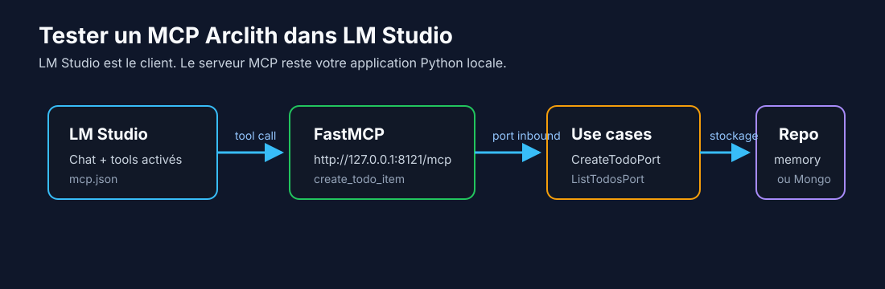

# 5.3 Tester le MCP dans LM Studio

Intention: vérifier qu'un client MCP piloté par un modèle peut découvrir et appeler les tools du
service.

Garder le serveur MCP Arclith lancé:

```bash
MODE=mcp_http uv run python main.py
```

Dans LM Studio:

1. Ouvrir le panneau de droite.
2. Aller dans l'onglet `Program`.
3. Cliquer sur `Install`, puis `Edit mcp.json`.
4. Ajouter le serveur MCP du tutoriel.

Si le fichier est vide, utiliser:

```json
{
  "mcpServers": {
    "todo-list-service": {
      "url": "http://127.0.0.1:8121/mcp"
    }
  }
}
```

Tester ensuite dans un chat LM Studio:

```text
Utilise les tools disponibles pour créer une todo:
titre Tester LM Studio MCP, description Appel MCP depuis LM Studio,
échéance 2026-09-01, statut todo.
```

Le test est réussi si LM Studio voit les tools `create_todo_item` et `list_todo_items`, appelle le
serveur `http://127.0.0.1:8121/mcp`, et que les logs du service Arclith montrent l'appel entrant.



## Et LangGraph ?

LM Studio Chat consomme ici un serveur MCP. Il ne se branche pas directement sur l'Agent Server
LangGraph `http://127.0.0.1:2024`, car cette API expose des `threads` et des `runs`, pas une API MCP
ou Chat Completions.

Le chemin recommandé pour l'agent reste:

```text
client local -> LangGraph :2024 -> adapter LLM -> LM Studio :1234/v1
```

Un pont MCP peut appeler LangGraph, mais il doit être développé comme serveur MCP dédié. Dans ce cas,
LM Studio orchestre le chat et LangGraph devient un tool appelé par le modèle.

Étape suivante: [ajouter un agent](06-agent.md).
