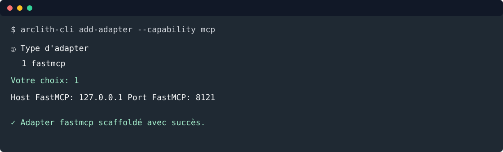

# 5. Exposer un MCP

Objectif: générer la configuration FastMCP avec la CLI, puis exposer les mêmes opérations métier via
des tools MCP.



Depuis la racine du projet:

```bash
arclith-cli add-adapter --capability mcp
```

Répondre aux prompts:

```text
① Type d'adapter
   1  fastmcp

  Votre choix (numéro ou nom): 1

③ Paramètres fastmcp
  Host FastMCP (127.0.0.1): 127.0.0.1
  Port FastMCP (8001): 8121

  Confirmer la génération ? [y/n] (y): y
```

La CLI crée:

```text
config/adapters/inbound/fastmcp.yaml
```

## Tools MCP

Créer `src/todo_list_service/adapters/inbound/fastmcp/tools/todo_tools.py`:

```python
from __future__ import annotations

from datetime import date, datetime
from typing import Annotated

import fastmcp
from pydantic import Field

from arclith.domain.ports.outbound.repository import Repository
from todo_list_service.adapters.inbound.schemas.todo_schema import TodoSchema
from todo_list_service.application.use_cases.create_todo import CreateTodoCommand, CreateTodoUseCase
from todo_list_service.domain.models.todo import Todo, TodoStatus


class TodoMCP:
    def __init__(
        self,
        create_todo: CreateTodoUseCase,
        repository: Repository[Todo],
        mcp: fastmcp.FastMCP,
    ) -> None:
        self._create_todo = create_todo
        self._repository = repository
        self._mcp = mcp
        self._register_tools()

    def _register_tools(self) -> None:
        create_todo = self._create_todo
        repository = self._repository

        @self._mcp.tool
        async def create_todo_item(
            title: Annotated[str, Field(description="Titre court de la todo.")],
            due_date: Annotated[date, Field(description="Date d'échéance ISO, ex. 2026-09-01.")],
            description: Annotated[str, Field(description="Description détaillée.")] = "",
            status: Annotated[TodoStatus, Field(description="todo, wip ou done.")] = TodoStatus.TODO,
            completed_at: Annotated[datetime | None, Field(description="Date de réalisation si status=done.")] = None,
        ) -> dict:
            """Create a todo through the application use case."""
            todo = await create_todo.execute(
                CreateTodoCommand(
                    title=title,
                    description=description,
                    due_date=due_date,
                    status=status,
                    completed_at=completed_at,
                )
            )
            return TodoSchema.model_validate(todo).model_dump(mode="json")

        @self._mcp.tool
        async def list_todo_items() -> list[dict]:
            """List todos currently available in the repository."""
            todos = await repository.find_all()
            return [TodoSchema.model_validate(todo).model_dump(mode="json") for todo in todos]
```

Créer `src/todo_list_service/adapters/inbound/fastmcp/tools/__init__.py`:

```python
from todo_list_service.adapters.inbound.fastmcp.tools.todo_tools import TodoMCP

__all__ = ["TodoMCP"]
```

Créer `src/todo_list_service/adapters/inbound/fastmcp/register.py`:

```python
from __future__ import annotations

import fastmcp

from arclith import Arclith
from todo_list_service.adapters.inbound.fastmcp.tools import TodoMCP
from todo_list_service.infrastructure.containers.todo_container import (
    build_create_todo_use_case,
    build_todo_repository,
)


def register_tools(mcp: fastmcp.FastMCP, arclith: Arclith) -> None:
    repository = build_todo_repository(arclith)
    create_todo = build_create_todo_use_case(arclith)
    TodoMCP(create_todo, repository, mcp)
```

## Entrypoint API + MCP

Remplacer `main.py` par:

```python
"""Application entrypoint for todo-list-service."""
from __future__ import annotations

import os
import sys
from pathlib import Path

import fastmcp
from arclith import Arclith
from todo_list_service.adapters.inbound.fastapi.register import register_routers
from todo_list_service.adapters.inbound.fastmcp.register import register_tools

_CONFIG = Path(__file__).parent / "config"
_VALID_MODES = {"api", "mcp_http", "all"}

MODE = os.getenv("MODE", "api")
if MODE not in _VALID_MODES:
    print(f"MODE invalide: {MODE!r}. Valeurs: {sorted(_VALID_MODES)}", file=sys.stderr)
    sys.exit(1)

arclith = Arclith(_CONFIG)

app = arclith.fastapi()
register_routers(app, arclith)


def build_mcp() -> fastmcp.FastMCP:
    mcp = arclith.fastmcp("Todo MCP")
    register_tools(mcp, arclith)
    arclith.instrument_mcp(mcp)
    return mcp


def _run_api() -> None:
    arclith.run_api("main:app")


def _run_mcp_http() -> None:
    arclith.run_mcp_http(build_mcp())


if __name__ == "__main__":
    match MODE:
        case "api":
            arclith.run_with_probes(_run_api, transports=["api"])
        case "mcp_http":
            arclith.run_with_probes(_run_mcp_http, transports=["mcp_http"])
        case "all":
            arclith.run_with_probes(_run_api, _run_mcp_http, transports=["api", "mcp_http"])
```

## Tester sans client externe

Créer `tests/test_todo_mcp.py`:

```python
import pytest
from fastmcp import Client

from main import build_mcp


@pytest.mark.asyncio
async def test_mcp_create_and_list_todos() -> None:
    async with Client(build_mcp()) as client:
        tools = await client.list_tools()
        assert {tool.name for tool in tools} >= {"create_todo_item", "list_todo_items"}

        result = await client.call_tool(
            "create_todo_item",
            {
                "title": "Tester le MCP",
                "description": "Appeler le même use case que l'API",
                "due_date": "2026-09-01",
                "status": "todo",
            },
        )

        assert not result.is_error

        listed = await client.call_tool("list_todo_items", {})
        assert not listed.is_error
```

Lancer:

```bash
uv run python -m pytest tests/test_todo_mcp.py
```

Smoke HTTP MCP:

```bash
MODE=mcp_http uv run python main.py
```

Le serveur écoute sur `http://127.0.0.1:8121/mcp`.

## Voie rapide

```bash
arclith-cli add-adapter \
  --capability mcp \
  --adapter fastmcp \
  --param host=127.0.0.1 \
  --param port=8121 \
  --yes
```

Étape suivante: [ajouter un agent](06-agent.md).
