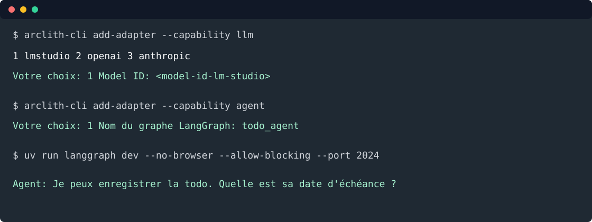
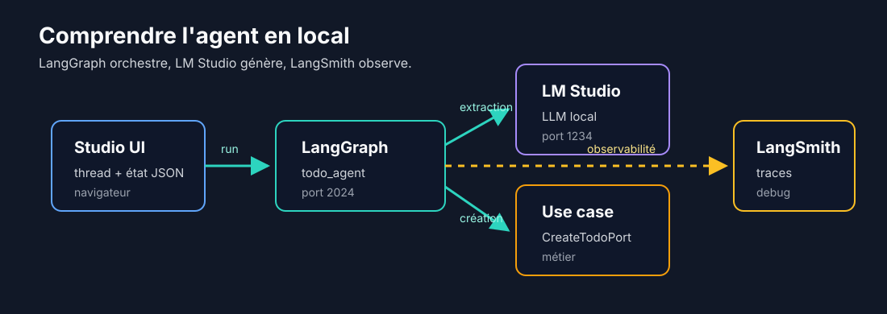

# 6. Ajouter un agent

Objectif: créer un agent LangGraph qui comprend une demande en langage naturel, choisit l'action
todo à exécuter, collecte seulement les champs vraiment manquants, puis appelle les mêmes ports
inbound que l'API et le MCP.



L'agent a quatre responsabilités:

- classifier l'intention: créer une todo, lister les todos, annuler une création en cours ou répondre
  que la demande n'est pas prise en charge;
- transformer une conversation en `TodoDraft`;
- conserver `draft` et `pending_field` dans l'état LangGraph pendant la phase de questionnement;
- appeler `CreateTodoPort` ou `ListTodosPort`.

Il ne connaît pas la persistance. Il ne parle ni à MongoDB ni au repository directement. Le chemin
reste:

```text
message utilisateur
  -> adapter LangGraph
  -> intent-interpreter / parsing local
  -> CreateTodoPort ou ListTodosPort
  -> use case applicatif
  -> Repository[Todo]
```

## Installer les dépendances agent

```bash
uv add "arclith[langgraph]"
```

## Créer les intent-interpreters

Depuis la racine du projet, créer deux interpréteurs:

```bash
arclith-cli add-intent-interpreter
arclith-cli add-intent-interpreter
```

Répondre:

```text
Interpréteur d'intention (ex : IngredientIntent, todo_intent)
  Nom de l'interpréteur: TodoAction

Interpréteur d'intention (ex : IngredientIntent, todo_intent)
  Nom de l'interpréteur: TodoConversation
```

Les deux fichiers ne font pas le même travail:

| Fichier | Rôle |
| --- | --- |
| `application/intent_interpreters/todo_action.py` | Classe l'action globale: créer, lister, annuler ou inconnu. C'est le fallback LLM quand le fast path local n'est pas assez sûr. |
| `application/intent_interpreters/todo_conversation.py` | Extrait les champs d'une todo dans un `TodoDraft`: titre, échéance, description, statut, date de réalisation. |

Ce découpage évite de demander au même prompt LLM de décider à la fois "quoi faire" et "quels champs
extraire". Le graphe peut router vite les cas évidents, puis appeler l'extraction uniquement quand
l'action est bien une création de todo.

Créer `src/todo_list_service/application/intent_interpreters/todo_action.py`:

```python
from enum import StrEnum

from arclith.domain.ports.outbound.llm import LLMPort
from pydantic import BaseModel, Field


class TodoAction(StrEnum):
    CREATE_TODO = "create_todo"
    LIST_TODOS = "list_todos"
    CANCEL_TODO_CREATION = "cancel_todo_creation"
    UNKNOWN = "unknown"


class TodoActionDecision(BaseModel):
    action: TodoAction = Field(default=TodoAction.UNKNOWN)


class TodoActionInterpreter:
    def __init__(self, llm: LLMPort) -> None:
        self._llm = llm

    async def classify(self, prompt: str) -> TodoActionDecision:
        return await self._llm.complete_structured(
            prompt,
            output_type=TodoActionDecision,
            instructions=(
                "Tu classes l'intention d'un utilisateur qui parle a un agent de gestion de todos. "
                "Retourne create_todo quand il veut creer, ajouter ou enregistrer une tache. "
                "Retourne list_todos quand il veut afficher, lister ou consulter les taches existantes. "
                "Retourne cancel_todo_creation quand il annule une creation de todo en cours. "
                "Retourne unknown quand l'intention n'est pas une action todo prise en charge."
            ),
        )
```

Créer `src/todo_list_service/application/intent_interpreters/todo_conversation.py`:

```python
from __future__ import annotations

from datetime import date, datetime

from arclith.domain.ports.outbound.llm import LLMPort
from pydantic import BaseModel, Field

from todo_list_service.domain.models.todo import TodoStatus


class TodoDraft(BaseModel):
    title: str | None = Field(default=None)
    description: str | None = Field(default=None)
    due_date: date | None = Field(default=None)
    status: TodoStatus | None = Field(default=None)
    completed_at: datetime | None = Field(default=None)


class TodoConversationInterpreter:
    def __init__(self, llm: LLMPort) -> None:
        self._llm = llm

    async def extract(self, prompt: str, current: TodoDraft) -> TodoDraft:
        today = date.today()
        return await self._llm.complete_structured(
            prompt,
            output_type=TodoDraft,
            instructions=(
                "Tu extrais les champs d'une todo a partir d'une conversation en francais. "
                "Quand la demande est de type 'ajoute une todo pour X' ou 'cree une todo pour X', "
                "X est le titre de la todo, sauf si l'utilisateur dit explicitement que c'est une description. "
                "Quand l'utilisateur dit 'je dois X', X est le titre de la todo. "
                f"Date courante: {today.isoformat()}. Interprete les dates relatives comme 'demain'. "
                "Si aucune description n'est explicite, laisse la description vide. "
                "Si aucun statut n'est explicite, utilise todo. "
                "Retourne uniquement les champs explicitement presents ou clairement deduits. "
                "Ne fabrique pas de titre ou de date. "
                f"Draft actuel: {current.model_dump_json(exclude_none=True)}"
            ),
        )
```

## Configurer LM Studio

Démarrer LM Studio Local Server sur `http://127.0.0.1:1234/v1`, puis vérifier les modèles:

```bash
curl -fsS http://127.0.0.1:1234/v1/models
```

Lancer le wizard LLM:

```bash
arclith-cli add-adapter --capability llm
```

Répondre:

```text
① Type d'adapter
   1  lmstudio
   2  openai
   3  anthropic

  Votre choix (numéro ou nom): 1

③ Paramètres lmstudio
  Model ID LM Studio: <model-id-lm-studio>
  Endpoint OpenAI-compatible LM Studio (http://127.0.0.1:1234/v1):
  API key LM Studio (lm-studio):

  Confirmer la génération ? [y/n] (y): y
```

La CLI crée:

```text
config/adapters/outbound/lm.yaml
```

## Configurer LangSmith

LangSmith est optionnel pour exécuter localement, mais utile pour inspecter les runs.

```bash
arclith-cli add-adapter --capability observability
```

Répondre:

```text
① Type d'adapter
   1  langsmith
   2  opentelemetry

  Votre choix (numéro ou nom): 1
  Activer LANGSMITH_TRACING [y/n] (y): y
  Projet LangSmith (todo-list-service): todo-list-service-dev
  Endpoint LangSmith (https://api.smith.langchain.com):
  LANGSMITH_API_KEY:
  Activer langsmith maintenant ? [y/n] (y): y
  Confirmer la génération ? [y/n] (y): y
```

La clé reste dans `.env`, jamais dans Git. La CLI ajoute `langsmith` à la liste
`observability.enabled`; OpenTelemetry peut être ajouté ensuite dans la même liste.

LangSmith sert ici à observer l'agent. Il ne remplace ni LangGraph ni LM Studio:

- LangGraph exécute le graphe localement;
- LM Studio fournit le modèle local;
- LangSmith affiche les runs, les messages, les appels LLM et les erreurs.



Ouvrir ensuite <https://smith.langchain.com>, vérifier que le projet
`todo-list-service-dev` existe, puis garder cet onglet ouvert pour inspecter les traces après les
premiers essais.

Si LangSmith refuse l'appel mais que LM Studio reçoit bien les requêtes, le problème est souvent
distinct du modèle local. Vérifier dans cet ordre:

1. `LANGSMITH_API_KEY` est présent dans `.env`;
2. `LANGSMITH_TRACING=true`;
3. `LANGSMITH_PROJECT=todo-list-service-dev`;
4. le compte connecté dans le navigateur a accès au même workspace LangSmith;
5. l'endpoint est bien `https://api.smith.langchain.com`.

## Générer l'entrypoint LangGraph

```bash
arclith-cli add-adapter --capability agent
```

Répondre:

```text
① Type d'adapter
   1  langgraph

  Votre choix (numéro ou nom): 1
  Nom du graphe LangGraph (agent): todo_agent
  Confirmer la génération ? [y/n] (y): y
```

La CLI crée:

```text
langgraph.json
config/adapters/inbound/langgraph.yaml
src/todo_list_service/adapters/inbound/langgraph/agent.py
```

## Découper l'agent

Remplacer l'agent monolithique généré par un package LangGraph découpé par responsabilités:

```text
src/todo_list_service/adapters/inbound/langgraph/
  agent.py
  collection.py
  dependencies.py
  formatters.py
  intent.py
  nodes.py
  parsing.py
  routing.py
  state.py
```

| Fichier | Rôle |
| --- | --- |
| `agent.py` | Assemble le graphe LangGraph, déclare les noeuds et expose l'objet `agent` utilisé par `langgraph.json`. |
| `state.py` | Définit `AgentState`, lit le dernier message utilisateur, reconstruit un `TodoDraft` depuis l'état, fabrique les messages assistant. |
| `dependencies.py` | Centralise l'instance `Arclith`, l'adapter LLM et les ports applicatifs, avec cache local par process. |
| `nodes.py` | Contient les fonctions de noeuds: router l'intention, collecter les champs, créer, lister, annuler, répondre inconnu. |
| `routing.py` | Contient uniquement les fonctions de conditional edges LangGraph. |
| `intent.py` | Fait la détection locale haute confiance avant fallback LLM. C'est ce qui évite de créer une tâche pour "Qu'est-ce que je dois faire aujourd'hui ?". |
| `collection.py` | Met à jour le draft, applique les défauts, détecte les champs manquants et génère la prochaine question. |
| `parsing.py` | Normalise le français, détecte les dates relatives, les statuts, l'annulation et les titres simples. |
| `formatters.py` | Transforme le résultat de `ListTodosUseCase` en réponse lisible pour l'utilisateur et en payload JSON. |

Ce découpage rend l'agent testable par morceaux. La logique de parsing local peut être testée sans
LangGraph, les noeuds peuvent être testés avec de faux use cases, et `agent.py` reste un fichier de
wiring.

## Fast path local et fallback LLM

Le noeud `route_intent` suit cette règle:

1. essayer `detect_high_confidence_action(prompt, state)`;
2. si le résultat est sûr, router sans appeler le LLM;
3. sinon appeler `TodoActionInterpreter.classify()`.

Exemples de fast path:

| Message | Action |
| --- | --- |
| `Liste mes todos` | `LIST_TODOS` |
| `Qu'est ce que je dois faire aujourd'hui ?` | `LIST_TODOS` |
| `Je dois acheter des bananes demain` | `CREATE_TODO` |
| `Annule` pendant une création | `CANCEL_TODO_CREATION` |

Le fallback LLM reste nécessaire pour les formulations ambiguës. Il ne persiste rien: il retourne
seulement une décision structurée.

## Collecte intelligente

La création utilise deux couches:

- `parsing.py` extrait localement les cas fréquents: `je dois X`, `demain`, `aujourd'hui`, `après-demain`;
- `TodoConversationInterpreter` complète via LLM quand le local ne suffit pas.

Les défauts sont appliqués côté `collection.py`:

- si aucune description n'est explicite, `description=""`;
- si aucun statut n'est explicite, `status=todo`;
- `completed_at` n'est demandé que si `status=done`;
- `due_date` reste obligatoire.

Ainsi, `Je dois acheter des bananes demain` crée directement une todo:

```text
title: acheter des bananes
due_date: demain
description: ""
status: todo
```

L'utilisateur peut aussi se raviser. Si `draft` ou `pending_field` existe et que le message ressemble
à une annulation, le graphe route vers `cancel_todo_creation` et vide le brouillon.

## Assembler le graphe

`agent.py` ne porte plus la logique métier. Il importe les noeuds, branche les routes conditionnelles
et expose `agent`:

```python
from typing import Any

from arclith import Arclith
from langgraph.graph import END, START

from todo_list_service.adapters.inbound.langgraph.dependencies import (
    action_interpreter,
    arclith,
    create_todo_use_case,
    intent_interpreter,
    list_todos_use_case,
)
from todo_list_service.adapters.inbound.langgraph.nodes import (
    answer_unknown as answer_unknown_node,
    cancel_todo_creation as cancel_todo_creation_node,
    collect_todo_details as collect_todo_details_node,
    create_todo as create_todo_node,
    list_todos as list_todos_node,
    route_intent as route_intent_node,
)
from todo_list_service.adapters.inbound.langgraph.routing import (
    route_after_collection,
    route_after_intent,
)
from todo_list_service.adapters.inbound.langgraph.state import AgentState
from todo_list_service.application.intent_interpreters.todo_action import TodoActionInterpreter
from todo_list_service.application.intent_interpreters.todo_conversation import TodoConversationInterpreter
from todo_list_service.domain.ports.inbound.create_todo import CreateTodoPort
from todo_list_service.domain.ports.inbound.list_todos import ListTodosPort


def _create_todo_use_case() -> CreateTodoPort:
    return create_todo_use_case()


def _list_todos_use_case() -> ListTodosPort:
    return list_todos_use_case()


def _action_interpreter() -> TodoActionInterpreter:
    return action_interpreter()


def _intent_interpreter() -> TodoConversationInterpreter:
    return intent_interpreter()


def _route_after_intent(state: AgentState) -> str:
    return route_after_intent(state)


def _route_after_collection(state: AgentState) -> str:
    return route_after_collection(state)


async def route_intent(state: AgentState) -> AgentState:
    return await route_intent_node(state, _action_interpreter)


async def collect_todo_details(state: AgentState) -> AgentState:
    return await collect_todo_details_node(state, _intent_interpreter)


async def create_todo(state: AgentState) -> AgentState:
    return await create_todo_node(state, _create_todo_use_case)


async def list_todos(state: AgentState) -> AgentState:
    return await list_todos_node(state, _list_todos_use_case)


async def answer_unknown(state: AgentState) -> AgentState:
    return await answer_unknown_node(state)


async def cancel_todo_creation(state: AgentState) -> AgentState:
    return await cancel_todo_creation_node(state)


async def run_agent(state: AgentState) -> AgentState:
    return await agent.ainvoke(state)


def register_agent(builder: Any, app: Arclith) -> None:
    builder.add_node("route_intent", route_intent)
    builder.add_node("collect_todo_details", collect_todo_details)
    builder.add_node("create_todo", create_todo)
    builder.add_node("list_todos", list_todos)
    builder.add_node("answer_unknown", answer_unknown)
    builder.add_node("cancel_todo_creation", cancel_todo_creation)

    builder.add_edge(START, "route_intent")
    builder.add_conditional_edges(
        "route_intent",
        _route_after_intent,
        ["collect_todo_details", "list_todos", "cancel_todo_creation", "answer_unknown"],
    )
    builder.add_conditional_edges(
        "collect_todo_details",
        _route_after_collection,
        ["create_todo", END],
    )
    builder.add_edge("create_todo", END)
    builder.add_edge("list_todos", END)
    builder.add_edge("answer_unknown", END)
    builder.add_edge("cancel_todo_creation", END)


agent = arclith.langgraph(AgentState, register_agent, name="todo_agent")
```

Le code complet des autres fichiers est dans le POC téléchargeable:
<https://github.com/karned-rekipe/arclith-POC-todo>.

## Tester l'agent

Lancer les tests unitaires agent:

```bash
uv run python -m pytest tests/test_todo_agent.py
```

Ces tests doivent couvrir les comportements importants:

- une réponse à `pending_field` met à jour le bon champ au lieu de relancer la même question;
- `Je dois acheter des bananes demain` extrait le titre et la date sans LLM;
- une annulation vide le brouillon et n'appelle pas `CreateTodoPort`;
- `Liste mes todos` appelle `ListTodosPort`;
- `Qu'est ce que je dois faire aujourd'hui ?` liste les todos au lieu de créer une tâche;
- les prompts ambigus passent par `TodoActionInterpreter`.

Lancer ensuite LangGraph Studio:

```bash
uv run langgraph dev --no-browser --allow-blocking --port 2024
```

Le terminal affiche une URL de ce type:

```text
https://smith.langchain.com/studio/?baseUrl=http://127.0.0.1:2024
```

Ouvrir cette URL. LangSmith Studio se connecte au serveur LangGraph local démarré sur le port
`2024`. La documentation de référence est:

- <https://docs.langchain.com/oss/python/langgraph/local-server>
- <https://docs.langchain.com/langsmith/quick-start-studio>

Si le navigateur bloque l'accès à `localhost`, relancer avec `--tunnel`:

```bash
uv run langgraph dev --no-browser --allow-blocking --port 2024 --tunnel
```

Dans Studio:

1. sélectionner le graphe `todo_agent`;
2. créer un nouveau thread;
3. envoyer l'état JSON ci-dessous;
4. répondre aux questions dans le même thread pour conserver `draft` et `pending_field`;
5. revenir dans le projet LangSmith pour lire la trace du run.

Créer une todo simple:

```json
{
  "messages": [
    {
      "role": "user",
      "content": "Je dois acheter des bananes demain"
    }
  ]
}
```

Résultat attendu:

```text
Todo creee: acheter des bananes (<uuid>).
```

Lister les todos:

```json
{
  "messages": [
    {
      "role": "user",
      "content": "Qu'est ce que je dois faire aujourd'hui ?"
    }
  ]
}
```

Résultat attendu: une réponse de listing, pas une question de création.

Tester une création incomplète:

```json
{
  "messages": [
    {
      "role": "user",
      "content": "Ajoute une todo pour écrire la doc"
    }
  ]
}
```

L'agent doit demander la date d'échéance, car `description` et `status` ont des défauts. Répondre
ensuite dans le même thread LangGraph pour conserver `draft` et `pending_field`.

Tester une annulation dans un état de création:

```json
{
  "messages": [
    {
      "role": "user",
      "content": "Annule"
    }
  ],
  "draft": {
    "title": "acheter des bananes"
  },
  "pending_field": "due_date"
}
```

Résultat attendu:

```text
Creation de todo annulee.
```

## Passer à MongoDB ensuite

Avec `repository: memory`, l'API/MCP et LangGraph ne partagent les données que s'ils tournent dans le
même processus. Pour partager entre processus, ajouter MongoDB.

Installer l'extra:

```bash
uv add "arclith[mongodb]"
```

Lancer le wizard:

```bash
arclith-cli add-adapter --capability repository
```

Répondre:

```text
① Type d'adapter
   1  memory
   2  mongodb
   3  duckdb
   4  mariadb

  Votre choix (numéro ou nom): 2

③ Paramètres mongodb
  db_name (todo-list-service): todo_list_service
  multitenant [y/n] (n): n
  Activer mongodb maintenant ? [y/n] (y): y
  Confirmer la génération ? [y/n] (y): y
```

La CLI crée les fichiers repository MongoDB et active:

```yaml
repository: mongodb
```

Il reste ensuite à démarrer MongoDB, déclarer l'URI dans un resolver de secrets local, puis relancer
API, MCP et LangGraph. Le pas-à-pas complet est dans [les annexes locales](07-local-services.md).

Les tests peuvent rester en `memory`: créez une fixture qui copie `config/` dans `tmp_path`, remplace
`repository: mongodb` par `repository: memory`, puis nettoie le cache du container entre deux tests.
C'est le bon compromis: le runtime prouve le partage inter-processus via MongoDB, et les tests restent
rapides, déterministes et sans dépendance à Docker.

## Voie rapide

```bash
uv add "arclith[langgraph]"
arclith-cli add-intent-interpreter TodoAction
arclith-cli add-intent-interpreter TodoConversation
arclith-cli add-adapter --capability llm --adapter lmstudio --param model_name="<model-id-lm-studio>" --yes
arclith-cli add-adapter --capability observability --adapter langsmith
arclith-cli add-adapter --capability agent --adapter langgraph --param graph_name=todo_agent --yes

# Ensuite, pour partager les données entre processus:
uv add "arclith[mongodb]"
arclith-cli add-adapter --capability repository --adapter mongodb --entity Todo --db-name todo_list_service --yes
# Puis suivre docs/tutorials/todo-list/07-local-services.md pour l'URI MongoDB.
```
