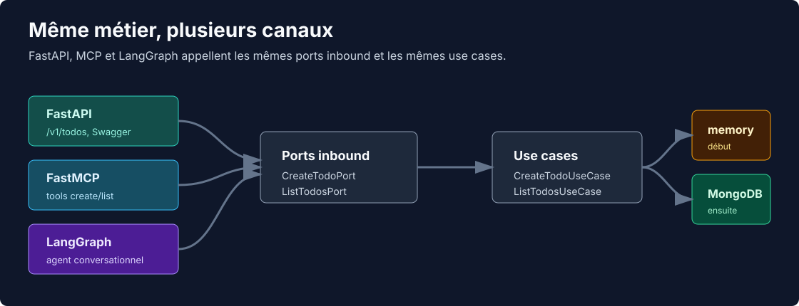

# Tutoriel Todo List

Ce tutoriel part de zéro et construit une todo list Arclith étape par étape.
L'objectif n'est pas seulement d'obtenir du code qui tourne: chaque étape montre pourquoi Arclith
garde le métier simple pendant que l'on branche FastAPI, MCP, LangGraph, LM Studio, LangSmith,
MongoDB et OpenTelemetry autour.



## Méthodologie Arclith

Arclith pousse une démarche hexagonale simple: on commence par le métier, puis on branche les outils
autour. Le cœur se construit dans cet ordre:

1. créer les entités qui portent les données et règles métier;
2. définir les ports inbound, c'est-à-dire les intentions que l'application expose;
3. écrire les use cases qui implémentent ces ports et orchestrent le métier;
4. brancher les adapters inbound comme FastAPI, FastMCP ou LangGraph;
5. choisir les adapters outbound comme `memory` ou MongoDB pour la persistance.

Cette séparation apporte la souplesse attendue d'une architecture hexagonale: l'API, le MCP, l'agent
et la base de données sont remplaçables sans déplacer le métier. On peut développer et tester les
use cases complètement indépendamment de FastAPI, FastMCP, LangGraph ou MongoDB, puis brancher ces
outils seulement quand le comportement applicatif est clair.

Le fil conducteur est volontairement simple:

- une entité `Todo`;
- deux ports inbound `CreateTodoPort` et `ListTodosPort`;
- deux use cases applicatifs pour enregistrer et lister les todos;
- une API FastAPI;
- un serveur MCP FastMCP;
- un agent LangGraph qui collecte les champs manquants avant d'appeler le même use case.

Le chemin principal utilise `repository: memory`. À la fin, on ajoute MongoDB pour partager les
données entre l'API, le MCP et l'agent quand ils tournent dans des processus différents.

## Modèle cible

Une todo contient:

| Champ | Type | Règle |
| --- | --- | --- |
| `title` | `str` | obligatoire, non vide |
| `description` | `str` | optionnel côté API, stocké comme chaîne |
| `due_date` | `date` | obligatoire |
| `completed_at` | `datetime | None` | renseigné seulement si le statut est `done` |
| `status` | `todo | wip | done` | `todo` par défaut |

## Architecture

```text
Client HTTP / Client MCP / LangGraph
  -> adapter inbound
  -> CreateTodoPort / ListTodosPort
  -> use case applicatif
  -> Repository[Todo]
  -> memory, puis MongoDB
```

Les adapters inbound ne parlent jamais directement au repository. Ils appellent les ports inbound,
exactement comme l'agent qui transforme une conversation en commande structurée puis appelle
`CreateTodoPort`.

L'étape FastAPI pousse aussi le contrat HTTP: format de réponse enveloppé, pagination, headers
standard, exemples OpenAPI et documentation détaillée des erreurs. L'idée est que la maturité API
vienne de l'adapter HTTP, tout en gardant le métier testable sans serveur web.

## Étapes

0. [Préparer LM Studio](00-lm-studio.md), utile avant l'étape agent
1. [Initialiser le projet](01-init-project.md)
2. [Créer l'entité Todo](02-create-entity.md)
3. [Créer les use cases](03-create-usecase.md)
4. [Exposer une API FastAPI](04-api.md)
5. [Exposer un MCP FastMCP](05-mcp.md)
6. [Ajouter un agent LangGraph](06-agent.md)
7. [Annexes locales: MongoDB, Compass et OpenTelemetry](07-local-services.md)

Chaque page montre le mode interactif de la CLI. La voie rapide non interactive est donnée en fin de
page pour les scripts et les reprises.

## Prérequis

- Python 3.13;
- `uv`;
- `git`;
- LM Studio seulement pour la dernière étape agent et le test MCP dans LM Studio;
- une clé LangSmith seulement si vous voulez tracer l'agent dans LangSmith.

Installer la CLI publiée:

```bash
uv tool install --force "arclith-cli>=0.12.0"
arclith-cli version
```

Le tutoriel utilise ensuite un projet local `todo-list-service`.
